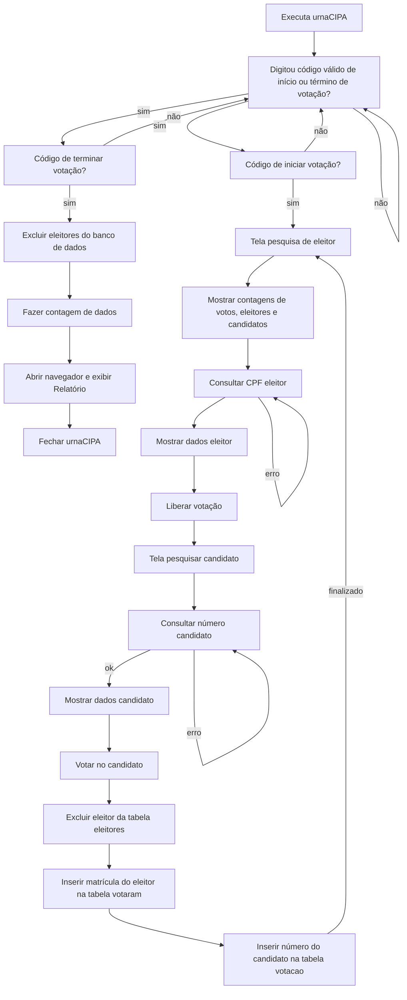

```mermaid
graph TD
    A[Executa urnaCIPA] --> B[Digitou código válido de início ou término de votação?]
    B --> |sim| C[Código de terminar votação?]
    B --> |não| B
    B --> |sim| D[Código de iniciar votação?]

    C -->|sim| F[Excluir eleitores do banco de dados]
    C -->|não| B
 
    D -->|sim| E[Tela pesquisa de eleitor]
    D -->|não| B
 
    E --> J[Mostrar contagens de votos, eleitores e candidatos]

    F --> G[Fazer contagem de dados]
    G --> H[Abrir navegador e exibir Relatório]
    H --> I[Fechar urnaCIPA]

    J --> L[Consultar CPF eleitor]
    L -->|erro| L
    L --> M[Mostrar dados eleitor]
    M --> N[Liberar votação]
    N --> O[Tela pesquisar candidato]

    O --> P[Consultar número candidato]    
    P -->|erro| P
    P -->|ok| Q[Mostrar dados candidato]

    Q --> R[Votar no candidato]   
    R --> S[Excluir eleitor da tabela eleitores]
    S --> T[Inserir matrícula do eleitor na tabela votaram]
    T --> U[Inserir número do candidato na tabela votacao]
    U -->|finalizado| E
```
