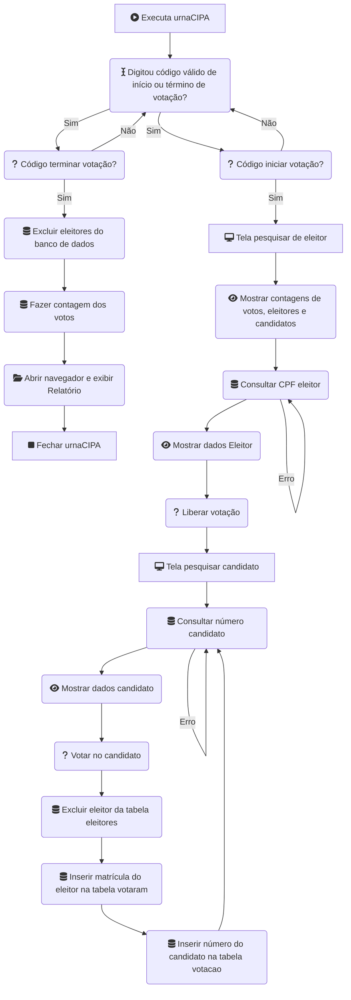

```mermaid
graph TD
  A[fa:fa-play-circle Executa urnaCIPA] --> B(fa:fa-i-cursor Digitou código válido de início ou término de votação?)
  B -->|Sim| C(fa:fa-question Código iniciar votação?)
  C -->|Não| B
  C -->|Sim| E[fa:fa-desktop Tela pesquisar de eleitor]
  D -->|Não| B
  B -->|Sim| D(fa:fa-question Código terminar votação?)
  D -->|Sim| F(fa:fa-database Excluir eleitores do banco de dados)
  F --> G(fa:fa-database Fazer contagem dos votos)
  G --> I(fa:fa-folder-open Abrir navegador e exibir Relatório)
  I --> J[fa:fa-stop Fechar urnaCIPA]
  E --> K(fa:fa-eye Mostrar contagens de votos, eleitores e candidatos)
  K --> L(fa:fa-database Consultar CPF eleitor)
  L --> |Erro| L
  L --> M(fa:fa-eye Mostrar dados Eleitor)
  M --> N(fa:fa-question Liberar votação)
  N --> O[fa:fa-desktop Tela pesquisar candidato]
  O --> P(fa:fa-database Consultar número candidato)
  P --> |Erro| P
  P --> Q(fa:fa-eye Mostrar dados candidato)
  Q --> R(fa:fa-question Votar no candidato)
  R --> S(fa:fa-database Excluir eleitor da tabela eleitores)
  S --> T(fa:fa-database Inserir matrícula do eleitor na tabela votaram)
  T --> U(fa:fa-database Inserir número do candidato na tabela votacao)
  U --> P
```